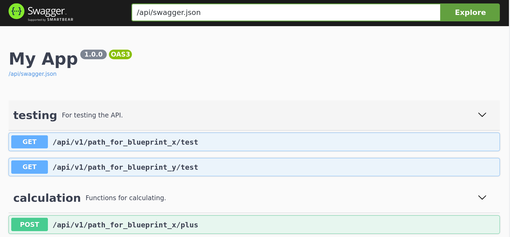

# Minimal Flask Application for RESTful APIs

This repository offers a minimal Flask application for RESTful APIs and can help you to quickly set up a REST API.

The following features are included in the application:

* Usage of endpoint blueprints
* Automated endpoint tests via pytest
* Production configuration for uwsgi
* API documentation using the OpenAPI 3 specification and Swagger UI

For more information, read [my blog post on Flask APIs](https://www.datascienceblog.net/post/programming/flask-api-development/).

## Setup

To set up the application, you need Python 3. After cloning the repository change to the project directory and install the dependencies via:

```
python3 -m pip install -r requirements.txt
```

## Development

To start the app in development mode, execute

```
./run_app_dev.sh
```

The application will then be available at `localhost:5000`. You can test the functionality manually using `curl`, e.g. via

```
curl localhost:5000/api/v1/path_for_blueprint_x/test
```

or through the automated tests, by running

```
pytest
```

The commands should output
```
{
  "msg": "I'm the test endpoint from blueprint_x."
}
```

and 

```
test/test_endpoints.py ....

============= 4 passed in 0.14s ==============
```

respectively.

To view the API documentation through the Swagger user interface, navivate your browser to `localhost:5000/api/docs`. 

## Production

To run the app in production, execute
```
./run_app_prod.sh 
```

Now the application is served on `localhost:8600`. To run the automated tests for the production host, use

```
pytest --host http://localhost:8600 
```

Steps to add a Mode:
- add the mode file in the api/src/endpoints/modes/ folder with the name {mode_name}_mode.py
- add the routing function in the {mode_name}_mode.py as follows: 
```
from flask import Blueprint, jsonify, request

mode_name_mode = Blueprint(name="mode_name", import_name=__name__)

@mode_name.route('/run', methods=['GET'])
def run():
  """
  ---
  get:
    description: this runs mode_name
    requestBody:
      required: true
      content:
          application/json:
              schema: InputSchema
    responses:
      '200':
        description: call successful
        content:
          application/json:
            schema: OutputSchema
    tags:
        - running
  """
  # do calculations 
  # start threads
  # create an output object 
  output = {
    "msg":"returned output from the calculations"
  }
  return jsonify(output)
```
- import the file in app.py as follows:
```
from src.endpoints.modes.mode_name_mode import mode_name_mode
```
and add the following line in the register_modes function:
```
app.register_blueprint(mode_name_mode, url_prefix="/api/v1/mode_name_mode")
```
and you're set!
To add the test unit test:
